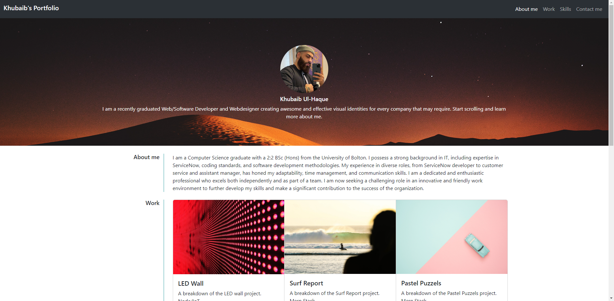
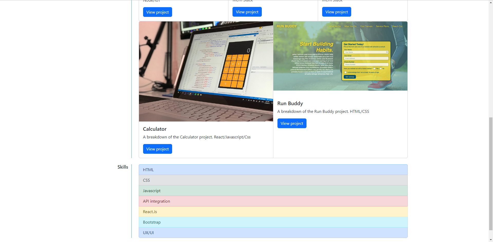

# Bootstrap Portfolio

Hello there! 👋 Welcome to my Bootstrap-powered portfolio repository. This project showcases my skills, projects, and provides a glimpse into who I am. Below, you'll find information about the setup, implementation, and technologies used in creating this portfolio.

## Table of Contents

- [Description](#description)
- [Features](#features)
- [User Acceptance Criteria](#user-acceptance)
- [Usage](#usage)
- [File Structure](#file-structure)
- [Technologies Used](#technologies-used)
- [Contributing](#contributing)
- [License](#license)

# Description 

This weeks Challenege is based around Bootstrap and how it makes life easier by not having to write your own code and use libraries to help. bootstrap makes it easier to allow the front end to look visually better.
I have implemented various Bootstrap components to create sections like the navigation bar, hero section (jumbotron), work section with Bootstrap cards, skills section, about/contact section, and a footer. This site is completley Responsive and i have also factored in individuals who use screen readers by applying HTML semantics to each section that require it.

## User Acceptance Criteria
1. Create a new GitHub repositories and name it `Bootstrap-Portfolio`.

2. Clone this repository to your computer.

3. Inside your `Bootstrap-Portfolio` repo, create the folder structure for the webpage.
   
   - Create a folder structure.

     - Create a `index.html`.

     - Create a `css` folder.

       - Inside create a `style.css` file.

   - Create an `images` folder.

       - Place all your images in this folder.

4. Using Bootstrap, recreate your portfolio site with the following items:

   The website should include the following bootstrap components:

    - A Navigation bar
    
    - A navigation menu at the top. Feel free to use the navbar code provided in Bootstrap's documentation, or create your own navbar by applying the correct Bootstrap classes to your HTML.

      - Include links that are applicable to your portfolio.
  
        - Links should navigate to the appropriate sections 

    - A hero section

        - A jumbotron featuring your picture, your name, and any other information you'd like to include.

    - A work section

      - A section displaying your work in grid. 

        - If you need to use placeholder image use: https://placehold.co/ 

      - Use bootstrap cards for each project.

        - The description should give a brief overview of the work.

      - Each project will eventually link to your class project work!

    - A skills section

      - List out the skills you expect to learn from the bootcamp.

    - An about / contact section.

      - An "About Me" section in the same row.
    
    - A footer section.

      - All hyperlinks should have a hover effect.

      - All buttons should display a box shadow upon hover.

5. Your Bootstrap solution should minimize use of media queries.

6. Deploy your new Bootstrap-powered portfolio to GitHub Pages.

## Repository Setup Instructions
### 1. Clone the Repository:
- git clone https://github.com/your-username/Bootstrap-Portfolio.git
### 2. Folder Structure and File Creation:
Inside the Bootstrap-Portfolio repository, I've organized the project with the following folder structure:

Bootstrap-Portfolio/
- ├── css/
- │    └── style.css
- └── images/
    - ├── image1.jpg
    - ├── image2.jpg
    - └── ...
- ├── index.html

### 3. Bootstrap Implementation:
I created an index.html file to structure the webpage.

Integrated Bootstrap into the project using the following CDN link in the head of the HTML file:

<link href="https://cdn.jsdelivr.net/npm/bootstrap@5.3.2/dist/css/bootstrap.min.css" rel="stylesheet"
    integrity="sha384-T3c6CoIi6uLrA9TneNEoa7RxnatzjcDSCmG1MXxSR1GAsXEV/Dwwykc2MPK8M2HN" crossorigin="anonymous">

I have implemented various Bootstrap components to create sections like the navigation bar, hero section (jumbotron), work section with Bootstrap cards, skills section, about/contact section, and a footer. This site is completley Responsive and i have also factored in individuals who use screen readers by applying HTML semantics to each section that require it.

### 4. Implementation of Specific Features:
Created a navigation menu at the top with links to different sections of the portfolio.
Included a hero section with a jumbotron featuring my picture, name, and relevant information.
Implemented a work section displaying projects in a grid using Bootstrap cards. Each card includes a brief overview of the work and a button linking to the respective project work.
Listed out skills in the skills section.
Created an About Me section in the same row as the contact section.
Ensured that all hyperlinks have a hover effect, and buttons display a box shadow upon hover.
### 5. Deploy to GitHub Pages:
After completing my Bootstrap-powered portfolio, I deployed it to GitHub Pages for public access.

### Technologies Used
- HTML
- CSS
- Bootstrap

## Screenshots

 
 
 

 ## Deployed application

 - Click here [Live Site](https://khubaibshah786.github.io/Bootstrap-Portfolio/).